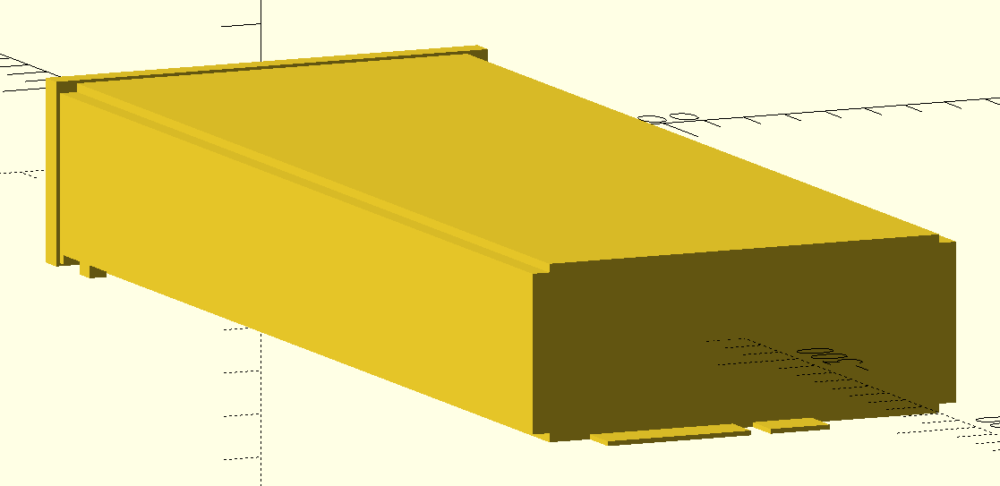
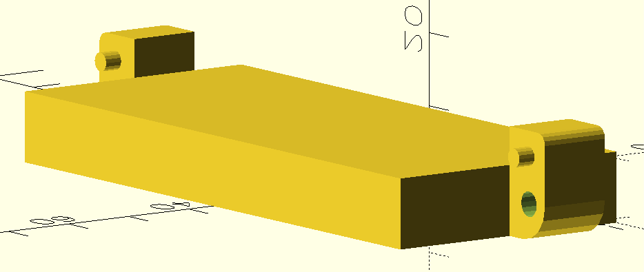
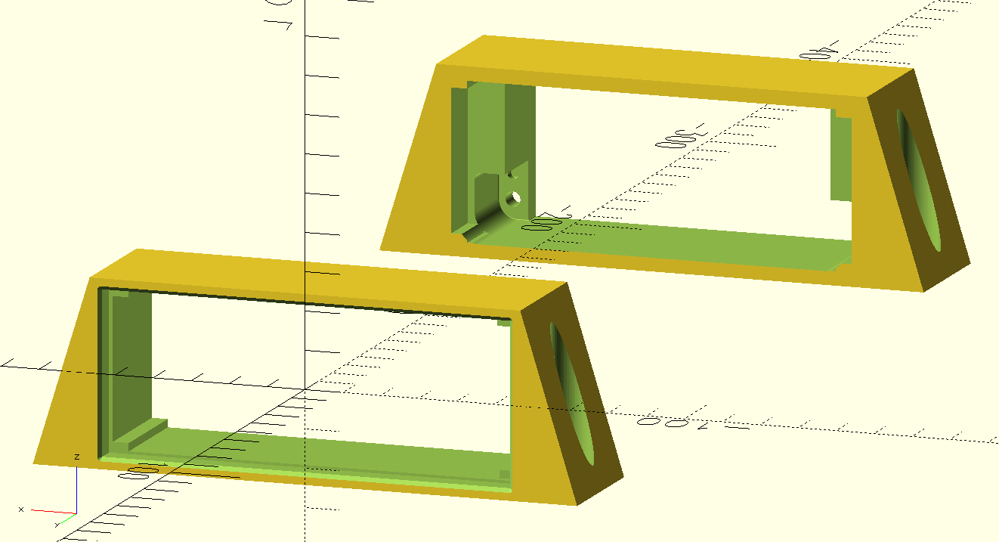
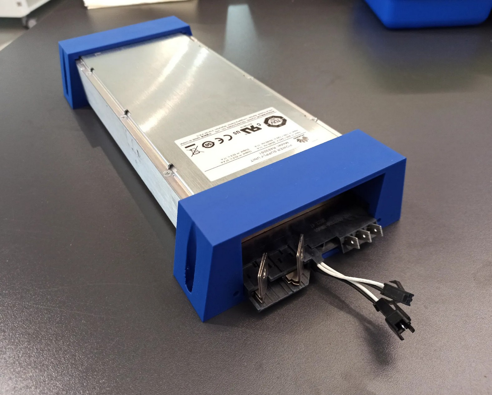

# Huawei R48xx
Documentation about Huawei 48V power supplies

## Existing information/documentation

- Review with lots of information (pinout, CAN, voltage range, etc.): https://www.beyondlogic.org/review-huawei-r4850g2-power-supply-53-5vdc-3kw/
- List of other related power supplies: https://www.ycict.net/de/products/huawei-r48100g1-rectifier-module/
- PHZ-F020304-BWxxx connector datasheets: https://www.medlonchina.com/FCI-connector-DC-120A-AC-40A.html

## 3D Models

### R4830S1 PSU (`psu.scad`)

Should also fit R4830G2, R4850G2 and R4850N2 as these are all 40.8x105x281mm.

Is modeled with a bit of clearance so it can be used as a negative directly and fit when 3D printed.



### PHZ-F020304-BW001 Connector (`connectors/PHZ-F020304-BW001/huawei-r4850g-connector.scad`)

Might also be compatible with other connector manufacturers if they have the same dimensions.

Is modeled **without clearance** so it should be expanded a bit to use as a negative.

Fits the PSU card-edge when positioned at the bottom back of the PSU extrusion/profile (`translate([0,-frontDepth - profileLength,-profileHeight/2])`).



### Case (`psu-case.scad`)

Parts to mount a Huawei R4830S1 PSU and PHZ-F020304-BW001 connector to a plate/board.

Mounts to the board using 4mm countersink screws, the connector is mounted to the part with M3 screws.

The PSU can slide in from the front and is held in place using the original metal handle/clip on the front of the PSU.

Also on [Printables](https://www.printables.com/model/1192666-huawei-r48xx-psu-mount).



(Photo is of an old version with less space for the screwdriver and with steeper angles which was more fragile)

## Connectors
There seem to be a handful of connectors that are compatible with these power supplies.
I have not yet done an exact comparison between the different connectors / PSU card edges, but likely some of these connectors and card edges are cross-compatible with each other as they look at least similar.

### Jonhon [DP4SC0504-001](./connectors/Jonhon_DP4SC0504-001_Datasheet_for_Huawei_R4850.pdf), DP4SC0504-003
Fits at least R4850G2

### [PHZ-F020304-BW00x](./connectors/PHZ-F020304-BW001/PHZ-F020304-BW00X系列连接器（85A\).docx)
My R4830S1 came with one, so it does definitely fit that.

## Connections

looking at the connector at the back of the PSU, the connections (left to right are):

- DC negative (not earth referenced)
- (DC Pre-charge)
    - connected to DC negative internally
    - likely used to pre-charge internal capacitors via a resistor when plugging in module with battery voltage present
- DC positive (not earth referenced)
- Slot detect (top/bottom)
    - can both be pulled to DC negative to enable PSU
    - resistor signaling used for addressing PSU by its slot
- CAN (top/bottom)
    - top/white = CAN_L
    - bottom/black = CAN_H
- PE
- N
- L

### Output capacitors
The PSU output capacitors are **large**.
If you connect the unpowered PSU up to a battery, **there _will_ be sparks**.
To avoid this, the PSU should either be on already or a pre-charge resistor (possibly the internal one?) should be used.

### Fan control
The PSU's internal fan control method uses the _input/ambient temperature_ to determine the fan speed.
This means, even when under heavy load, the fan speed increases only marginally because the 
internal/PCB temperature doesn't really affect the input/ambient temperature sensor.  
This lets the PSU run _really_ hot (>80°C at full load).

There are CAN commands to set the fan mode (auto / full speed) and to set the fan duty cycle (0-100%).  
If running at anywhere near full power (>50% maybe) the fan speed should either be set to 100% or temperature
controlled via the duty cycle (if noise matters).


## CAN protocol

If you just want to control the PSU without implementing all the commands yourself, you can use my
fork of an existing ESPHome integration (either directly or as a reference implementation):
[patagonaa/esphome-huawei-r4850](https://github.com/patagonaa/esphome-huawei-r4850)

The CAN protocol is almost the same between all PSUs of the R48xx-series and apparently (with other protocol IDs)
is also used in other PSUs (like the R100030G with 1000V 30A, used for EV charging, for which there are docs in `/docs`)
and possibly even different power electronics products (there are hints pointing at the C28005G1 48V to 280V 5A
DC-DC converter and MPPT solar chargers).

### Disclaimer

This documentation is a summary of own tests, documentation of other products and a bunch of other peoples'
implementations and documentation (see [Sources](#sources)).  
Thus, this is incomplete and possibly not 100% correct. I did, however test and verify almost all of the things
documented here, with both an R4830S1 and R4850G6, so I'm reasonably sure it _is_ correct.

### General

The CAN interface uses 125kbps rate with extended 29-bit identifiers.

### CAN ID

The CAN message IDs do not specify a single value/register.
Instead, the message ID is used to encode the prococol, PSU address,
command, message direction, etc.

Example: `1081407F`

Interpretation:  
Bits: `000a aaaa abbb bbbb cccc cccc deee eefg`
- 0 (bit 31-29): always zero (CAN ID is 29-bit)
- a (bit 28-23): protocol ID (always `21`)
- b (bit 22-16): address (0 = broadcast, 1 = first, ...)
- c (bit 15-8): command id
- d (bit 7): message source (0 = from PSU, 1 = to PSU)
- e (bit 6-2): group mask (always `1F`)
- f (bit 1): hardware / software address (0 = hw, 1 = sw, always 1)
- g (bit 0): finished marker (0 = finished, 1 = more data coming)

Apparently the PSU can have a "hardware address" and "software address"
but even the original "SMU02B" controller seems to use only the software address.

The "software address" seems to be negotiated automatically if multiple PSUs are on one CAN bus (starting at 1).

The "hardware address" might be fixed per slot, because the original PSU rack has a network of resistors
and dip switches on the two "slot detect" pins of the connector. Possibly, this allows the PSU to know
which slot it is in, which might set the PSU "hardware address", but I haven't tested this.

### `40` Data Request
Requests a data response composed of multiple status messages (including one register each).

Example (to PSU):
`108140FE: 00 00 00 00 00 00 00 00`

### `40` Data Reponse
Example (from PSU):
```
1081407F: 01 0E 00 00 00 00 2A 01
1081407F: 01 70 00 00 00 1C DC 31
1081407F: 01 71 00 00 00 00 C7 F5
1081407F: 01 72 00 00 00 00 20 91
1081407F: 01 73 00 00 00 1C 20 9A
1081407F: 01 74 00 00 00 00 03 E6
1081407F: 01 75 00 00 00 00 CD B1
1081407F: 01 76 00 00 00 00 04 00
1081407F: 01 78 00 00 00 03 8B 80
1081407F: 01 7F 00 00 00 00 84 00
1081407F: 01 80 00 00 00 00 6C 00
1081407F: 01 81 00 00 00 00 8C 11
1081407F: 01 82 00 00 00 00 8C 07
1081407E: 01 83 00 00 10 00 00 00
```

Data bytes:
- Byte 0-1: register id
- Bytes 2-3: ? (always 0)
- Bytes 4-7: int32 value

Register values:
| register id | example                         | description                                      |
| ----------- | ------------------------------- | ------------------------------------------------ |
| `01 0E`     | `00 00 00 00 2A 01` = 10753 Hrs | Operating Hours (?)                              |
| `01 70`     | `00 00 00 1C DC 31` = 1847W     | Input Power ( / 1024 = A)                        |
| `01 71`     | `00 00 00 00 C7 F5` = 49.99Hz   | Input Frequency ( / 1024 = Hz)                   |
| `01 72`     | `00 00 00 00 20 91` = 8.14A     | Input Current ( / 1024 = A)                      |
| `01 73`     | `00 00 00 1C 20 9A` = 1800W     | Output Power ( / 1024 = W)                       |
| `01 74`     | `00 00 00 00 03 E6` = 97%       | Efficiency ( / 1024 = 0-1)                       |
| `01 75`     | `00 00 00 00 CD B1` = 51.4V     | Output Voltage ( / 1024 = V)                     |
| `01 76`     | `00 00 00 00 04 00` = 82%       | Max Output Current\* ( / 1250 = 0-1)             |
| `01 78`     | `00 00 00 03 8B 80` = 226.8V    | Input Voltage ( / 1024 = V)                      |
| `01 7F`     | `00 00 00 00 84 00` = 33°C      | Output Temperature ( / 1024 = °C)                |
| `01 80`     | `00 00 00 00 6C 00` = 27°C      | Input Temperature ( / 1024 = °C)                 |
| `01 81`     | `00 00 00 00 8C 11` = 35.02A    | Output Current 1 (fast/unfiltered) ( / 1024 = A) |
| `01 82`     | `00 00 00 00 8C 07` = 35.01A    | Output Current 2 (slow/filtered) ( / 1024 = A)   |
| `01 83`     | `00 00 10 00 00 00` = ?         | Alarm/Status bits (Details under `docs/`)        |

\* Not necessarily the set limit, rather what the PSU is currently _capable of_ outputting, see [Output current limit](#output-current-limit)

### `50` Info Request
Requests an info response composed of multiple messages (including one register each).

Example (to PSU): `108150FE: 00 00 00 00 00 00 00 00`

### `50` Info Response
Example (from PSU):
```
1081507F: 00 01 00 00 40 46 12 67
1081507F: 00 02 64 46 85 50 02 AF
1081507F: 00 03 32 31 30 32 33 31
1081507F: 00 04 31 54 52 52 4C 55
1081507F: 00 05 05 00 01 0D 01 0D
1081507E: 00 06 01 01 00 00 00 00
```

Data bytes:
- Byte 0-1: register id
- Bytes 2-7: data

Registers:
| register id | data                | example                                                                      | description                                                             |
| ----------- | ------------------- | ---------------------------------------------------------------------------- | ----------------------------------------------------------------------- |
| `00 01`     | `?? ?? ?? ?? ?? ??` | `00 01 00 00 40 46 12 67` (R4830S1) /<br>`00 01 00 00 40 68 0E 2C` (R4850G6) | Module characteristic data(?)                                           |
| `00 02`     | `xx xx xx xx xx xx` | `00 02 64 46 85 50 02 AF` = ?                                                | Serial number                                                           |
| `00 03`     | `xx xx xx xx xx xx` | `00 03 32 31 30 32 33 31` = "210231"                                         | Barcode part 1 (ASCII)                                                  |
| `00 04`     | `xx xx xx xx xx xx` | `00 04 31 54 52 52 4C 55` = "1TRRLU"                                         | Barcode part 2 (ASCII)                                                  |
| `00 05`     | `xx xx yy yy zz zz` | `00 05 05 00 01 0D 01 0D`                                                    | `xx` = HW version,<br>`yy` = DC-DC SW version,<br>`zz` = PFC SW version |
| `00 06`     | `xx xx 00 00 00 00` | `00 06 01 01 00 00 00 00`                                                    | Hardware address                                                        |

### `D2` E-Label Request
Requests an "E-Label" response composed of multiple status messages (including one part of the ASCII response each).

Example (to PSU): `1081D2FE: 00 00 00 00 00 00 00 00`

### `D2` E-Label Response

Example (from PSU):
```
1081D27F: 00 01 2F 24 5B 41 72 63
1081D27F: 00 02 68 69 76 65 73 49
1081D27F: 00 03 6E 66 6F 20 56 65
1081D27F: 00 04 72 73 69 6F 6E 5D
[...]
1081D27F: 00 33 3D 30 30 0D 0A 43
1081D27F: 00 34 4C 45 49 43 6F 64
1081D27F: 00 35 65 3D 0D 0A 42 4F
1081D27E: 00 36 4D 3D 0D 0A 00 00
```

- Byte 0-1: Message part number
- Bytes 2-7: ASCII Data (null-terminated)

Decodes to:
```
/$[ArchivesInfo Version]
/$ArchivesInfoVersion=3.0


[Board Properties]
BoardType=EN1MRC3S1A1
BarCode=2102311TRRLUL4000687
Item=02311TRR
Description=Function Module,R4830S1,EN1MRC3S1A1,1U2000W Super High Efficiency Rectifier,DS Special
Manufactured=2020-05-06
VendorName=Huawei
IssueNumber=00
CLEICode=
BOM=
```

### `80` Register Set Request
Sets the value of a register.

Example (to PSU): `108180FE: 01 34 00 01 00 00 00 00`

Data bytes:
- Byte 0-1: register id
- Byte 2-7: data

Registers:
| register id | data                | example                                                                          | description                                                                                    |
|-------------|---------------------|----------------------------------------------------------------------------------|------------------------------------------------------------------------------------------------|
| `01 00`     | `00 00 xx xx xx xx` | 53.5V * 1024 = 0x0000D600<br>= `01 00 00 00 00 00 D6 00`                         | Output voltage (V * 1024)                                                                      |
| `01 01`     | `00 00 xx xx xx xx` |                                                                                  | Default output voltage (V * 1024)                                                              |
| `01 02`     | `00 00 xx xx xx xx` |                                                                                  | Overvoltage protection? (V * 1024)                                                             |
| `01 03`     | `00 00 xx xx xx xx` | 10A / 42.6A (for R4830S1) * 1250<br>≈ 293 = 0x125<br>= `01 03 00 00 00 00 01 25` | Current limit\* (0-1 * 1250)                                                                   |
| `01 04`     | `00 00 xx xx xx xx` |                                                                                  | Default current limit\* (0-1 * 1250)                                                           |
| `01 09`     | `00 xx yy yy yy yy` | 4A * 1024 = 0x00001000<br>= `01 09 00 01 00 00 10 00`<br> (active bit set)       | Input/AC current limit\*\*<br>(persistent)<br>`xx` = limit active<br>`yy` = current (A * 1024) |
| `01 14`     | `xx xx 00 00 00 00` | 50% = 0.5 * 25600 = 12800<br>= `01 14 32 00 00 00 00 00`                         | Fan duty cycle\*\*\* (0-1 * 25600)                                                             |
| `01 32`     | `00 xx 00 00 00 00` |                                                                                  | Standby<br>`00` = PSU on<br>`01` = standby                                                     |
| `01 34`     | `00 xx 00 00 00 00` |                                                                                  | Fan mode<br>`00` = auto<br>`01` = max<br>`02` = max (persistent)                               |

\* See [Output current limit](#output-current-limit)  
\*\* Hitting the input/AC current limit (when set to a low value like 5A) can cause the fan to turn off temporarily, even if a fan duty cycle is set.
     When the output temperature hits a threshold of ~75°C, the fan is turned on again and turned off again at ~65°C.
     Setting the fan mode to max overrides this and always turns on the fan.  
\*\*\* Can only be set to 0 or above the min. duty cycle (see [Register Get Response](#82-register-get-response)). (other values return an error and reset the internal value to 0 (auto)).  
     On the R4850G6, the min. duty depends on the temperature  
     On the R4830S1, the min. duty is the current setpoint (which is probably a bug), so the duty cycle can only be increased or set to 0.

### `80` Register Set Response
Response to setting a register value.
Has an error status field in case the value is out of range or the parameter doesn't exist.

Example (from PSU): `1081807E: 01 34 00 01 00 00 00 00`

Data bytes:
- Byte 0 (low nibble): status (`0` = ok, `2` = parameter error)
- Byte 0 (high nibble) - 7: copied from request

### `82` Register Get Request
Gets the value from a register.  
Seems to work only for status registers (`01 70`, ...) not for config registers (`01 00`, ...).

Example (to PSU):
`108182FE: 01 34 00 00 00 00 00 00`

Data bytes:
- Byte 0-1: register id
- Byte 2-7: zero

### `82` Register Get Response
Response to getting a register value.
Has an error status field in case the parameter doesn't exist or can't be read.

Example (to PSU):
`1081827E: 01 34 00 01 00 00 00 00`

Data bytes:
- Byte 0 (low nibble): status (`0` = ok, `2` = parameter error)
- Byte 0 (high nibble) - 1: register id
- Byte 2-7: register value

Registers (in addition to ones from [`40` data response](#40-data-reponse));
| register id | data                | example                                                                   | description                                                                                                     |
| ----------- | ------------------- | ------------------------------------------------------------------------- | --------------------------------------------------------------------------------------------------------------- |
| `01 87`     | `xx xx yy yy zz zz` | `01 87 2D 00 64 00 4B 87` =<br>min. duty 45%<br>duty set 100%<br>19335RPM | Fan control/status<br>`xx` = min. duty cycle\* (/25600)<br>`yy` = duty cycle target\*\* (/ 25600)<br>`zz` = RPM |

\*   On the R4850G6, the min. duty cycle is based on the current temperature (see [Fan control](#fan-control)).  
     On the R4830S1, the min. duty cycle is always equal to the duty cycle target.  
\*\* On both PSUs, the duty cycle target is the greater of both the temperature-based duty cycle and the duty cycle set via CAN.


### `11` Unsolicited
Sent from the PSU unsolicited (without requesting anything).  
Due to no documentation being available on any of this, the following is mostly speculation / own findings.

Example (from PSU):
```
1001117E: 00 01 00 00 00 00 04 97
100011FE: 00 02 00 00 00 00 03 FE
108111FE: 00 03 00 00 00 01 00 00
```

Messages:
| proto id | address       | dir          | interval | register id (?) |
| -------- | ------------- | ------------ | -------- | --------------- |
| `20`     | 1 (PSU)       | 0 (from PSU) | ~377ms   | `00 01`         |
| `20`     | 0 (broadcast) | 1 (to PSU)   | ~3000ms  | `00 02`         |
| `21`     | 1 (PSU)       | 1 (to PSU)   | ~377ms   | `00 03`         |

Due to the different message directions and addresses, and due to the load/current being included,
I think these are used for both address negotiation and automatic load sharing between multiple PSUs
connected to the same CAN bus.

Due to the messages including the current and being in regular intervals, they might (or at least could)
also be used as a coulomb counter.

Data bytes:
- Byte 0-2: register id (?)
- Bytes 2-7: register values (?)

| register id | data                | example                                        | description                                                                                           |
| ----------- | ------------------- | ---------------------------------------------- | ----------------------------------------------------------------------------------------------------- |
| `00 01`     | `?? xx ?? ?? yy yy` | `00 01 00 00 00 00 04 97`<br>= ready, 94% load | `xx` = ready\*\* status (`00` = ready, `01` = not ready)<br>`yy` = Output load\* ( / 1250 = 0-1)      |
| `00 02`     | `?? ?? ?? ?? yy yy` | `00 02 00 00 00 00 03 FE`<br>= 82% load        | `yy` = Output load\* ( / 1250 = 0-1)                                                                  |
| `00 03`     | `?? ?? ?? xx yy yy` | `00 03 00 00 00 01 00 00`<br>= active, 0% load | `xx` = active\*\*\* status (`00` = not active, `01` = active)<br>`yy` = Output load\* ( / 1250 = 0-1) |

\*     The value in `00 01` seems to update faster than the one in `00 03`. For calculatung current from this, see [Output current limit](#output-current-limit)  
\*\*   ready: PSU is ready to output voltage/power (AC input available, not faulted, ...)  
\*\*\* active: device is outputting voltage/power (not booting, not standby, ...)  

### Additional Notes

#### CAN communication power
The CAN communication is powered by the DC side.
This means CAN communication is always possible when there is a battery connected, even if there is no AC input present.    

#### Default values
For some values (mostly voltage and current) there is a "default" value (which is saved in non-volatile memory)
in addition to the "running" value.  
This means, the voltage/current will be reset to these default settings after power loss
or CAN communication loss (after ~60s timeout, shown by flashing yellow light on front panel)
and has to be set again once CAN communication is (re-)established.

#### Value ranges

Most CAN values have a multiplier of 1024 (50V * 1024 = 51200 = 0xC800).  
When setting parameters, the PSU reports an error when the value exceeds the valid range.

Valid ranges (tested with R4830S1 and R4850G6)
- Voltage: 41.0V (`A4 00`) to 58.6V (`EA 67`)
- Default Voltage: 48.0V (`C0 00`) to 58.4V (`E9 9A`)
- Current: 0% (`00 00`) to 100% (`04 E2`)
    - Weirdly enough, this value goes up to 1250 instead of 1024, but 1250 coincides
      pretty well with the maximum current from the graph in the datasheet (see [Output current limit](#output-current-limit)).  
- Fan duty cycle:
    - R4830S1: can be set to auto (`00 00`) or between 30% (`1E 00`) and 100% (`64 00`)
    - R4850G6: can be set to auto (`00 00`) or between [min. duty cycle](#82-register-get-response) (temperature dependent) and 100% (`64 00`)

#### Output current limit

The output current limit is set as a ratio of the maximum possible output current.  
For the R4830S1, this means 1250 ≈ 42.6A, for the R4850G6 1250 ≈ 63.3A
(both compared to the PSU's internal current measurment).

This means, to set a current limit of 10A for the R4830S1,
the register should be set to: 10A / 42.6A * 1250 ≈ 293 = `00 00 01 25`.

The max output current readout (register `01 76`) uses the same scale but does not necessarily equal the limit
that has been _set_, but rather specifies what the PSU is currently set to _and capable of outputting_.  
This includes the output current limit (of course), but also the AC current limit
and possibly also the AC voltage, DC voltage, temperature derating, etc.

Examples (R4850G6):
| DC current limit | AC current limit | AC voltage | DC voltage | Result             | Limited by   |
| ---------------- | ---------------- | ---------- | ---------- | ------------------ | ------------ |
| 100%             | off              | 230V       | 49.5V      | 96% (60.9 / 63.3A) | PSU capacity |
| 50%              | off              | 230V       | 49.5V      | 50% (31.7 / 63.3A) | DC limit     |
| 100%             | 2A               | 230V       | 49.5V      | 14% (9.0 / 63.3A)  | AC limit     |

### Sources

This information was put together from several sources, such as:
- own CAN dumping/testing
- https://github.com/craigpeacock/Huawei_R4850G2_CAN
- https://endless-sphere.com/sphere/threads/rectifier-huawei-r4850g2-48v-42-58v-3000w.86038/post-1809287
- https://endless-sphere.com/sphere/threads/rectifier-huawei-r4850g2-48v-42-58v-3000w.86038/post-1805865
- https://endless-sphere.com/sphere/threads/rectifier-huawei-r4850g2-48v-42-58v-3000w.86038/post-1807301
- https://github.com/BotoX/huawei-r48xx-esp32
- https://github.com/577fkj/PowerControl/blob/c6d06935af79fcdbf3e71d1ad7ea4a86cd0c756f/main/src/protocol/huawei_r48xx.c
- https://max.book118.com/html/2022/0414/5230000111004213.shtm
    - see `docs/`
- https://tieba.baidu.com/p/7475319470